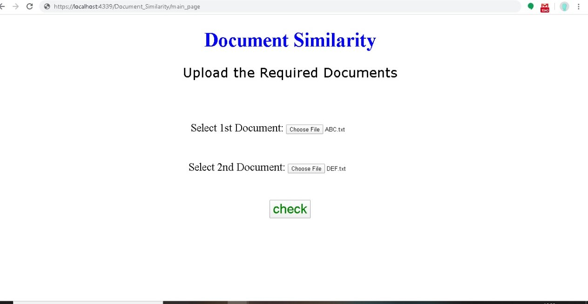

# document-similarity

Attempts to quantify the similarity between two documents.

### cosine similarity

Converts two documents to vectors and computes the similarity between those vectors.
Similarity is calculated by taking the inner product space that measures the cosine angle between them.

This is the Front page of the application that takes two documents and gives the percentage of similarity between the two documents.

